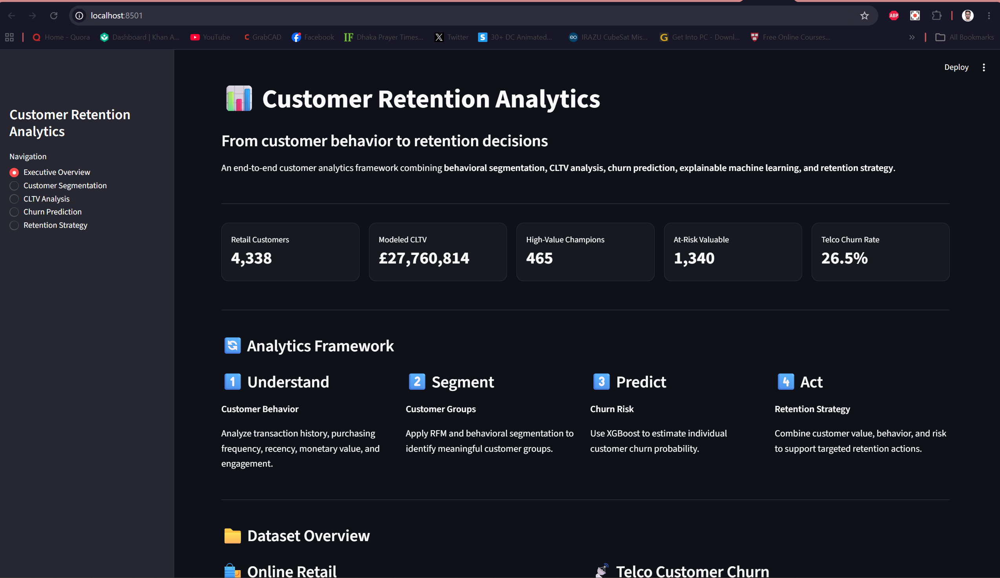

# Customer Segmentation, Lifetime Value & Churn Prediction

An end-to-end customer analytics project combining **RFM analysis, behavioral segmentation, customer lifetime value (CLTV), explainable churn prediction, and retention strategy**.

The project uses two publicly available Kaggle datasets representing different business contexts:

- **Online Retail** — customer behavior, segmentation, and CLTV
- **Telco Customer Churn** — churn analysis and predictive modeling

The datasets are intentionally analyzed separately and connected through a broader customer-retention framework.

---

## 🚀 Project Overview

Customer retention requires more than identifying customers who may churn.

This project combines:

1. **Customer behavior analysis**
2. **RFM-based segmentation**
3. **Behavioral clustering**
4. **Customer lifetime value estimation**
5. **Churn prediction**
6. **Explainable AI using SHAP**
7. **Retention strategy development**
8. **Interactive Streamlit dashboard**

The goal is to demonstrate an end-to-end machine learning workflow from raw customer data to actionable analytical insights.

---
## 📊 Dashboard Preview



---

## 🏗️ Project Architecture

```text
                    CUSTOMER DATA
                         │
             ┌───────────┴───────────┐
             │                       │
      Online Retail             Telco Churn
             │                       │
             ▼                       ▼
       Data Cleaning            Data Cleaning
             │                       │
             ▼                       ▼
       RFM Analysis           Exploratory Analysis
             │                       │
             ▼                       ▼
   Behavioral Segmentation      Churn Modeling
             │                       │
             ▼                       ▼
          CLTV                 XGBoost + SHAP
             │                       │
             └───────────┬───────────┘
                         │
                         ▼
                RETENTION STRATEGY
                         │
                         ▼
               STREAMLIT DASHBOARD


📊 Datasets
1. Online Retail

Source:

https://www.kaggle.com/datasets/vijayuv/onlineretail

Business context: E-commerce

The dataset contains transaction-level purchasing information including:

Invoice number
Product
Quantity
Unit price
Invoice date
Customer ID
Country

After cleaning:

392,692 transaction rows
4,338 customers
18,532 orders
£8.89M total revenue
Used for:

RFM analysis
Behavioral segmentation
Customer value analysis
CLTV estimation


2. Telco Customer Churn

Source:

https://www.kaggle.com/datasets/blastchar/telco-customer-churn

Business context: Telecommunications

The dataset contains customer demographic, service, contract, billing, and churn information.

Dataset size:

7,043 customers
26.54% overall churn rate

Used for:

Churn analysis
Predictive modeling
Risk scoring
Explainable machine learning
Retention strategy


🧹 Data Preparation
Online Retail

The following cleaning steps were applied:

Removed duplicate records
Removed transactions without Customer ID
Removed transactions without product descriptions
Removed non-positive quantities
Removed non-positive unit prices
Removed cancelled invoices
Calculated transaction revenue
Standardized Customer IDs

Processed dataset:

data/processed/online_retail_clean.csv
Telco

The following preprocessing was performed:

Converted TotalCharges to numeric
Handled missing TotalCharges
Removed duplicate records
Created tenure groups for exploratory analysis
Encoded the target variable for machine learning

Processed dataset:

data/processed/telco_churn_clean.csv


👥 Customer Segmentation
RFM Analysis

Customers were analyzed using:

Recency — how recently the customer purchased
Frequency — number of unique orders
Monetary — total customer revenue

Additional behavioral features included:

Active months
Orders per active month
Average order value
Unique products
Customer lifespan
Behavioral Segmentation

K-Means clustering was applied after:

Log transformation of skewed features
Standardization
Clustering using behavioral customer features

Four behavioral segments were identified:

Segment	Customers	Avg. Recency	Avg. Frequency	Avg. Monetary
High-Value Champions	465	17.09	17.49	£10,735.45
Engaged Loyal Customers	1,418	37.20	4.73	£1,796.16
At-Risk Valuable Customers	1,340	130.95	1.54	£837.64
Low-Value Inactive Customers	1,115	148.21	1.47	£202.54

The segments are descriptive behavioral groups and should not be interpreted as causal customer categories.

💰 Customer Lifetime Value

A scenario-based revenue CLTV proxy was developed using:

Average Order Value
        ×
Expected Monthly Purchase Frequency
        ×
Expected Lifetime

The primary dashboard metric uses a 12-month scenario.

Overall modeled CLTV
Mean: £6,399
Median: £3,897
90th percentile: £10,142

The distribution is strongly right-skewed, with a small number of customers contributing very large modeled values.

CLTV by behavioral segment
Segment	Mean CLTV	Total Modeled CLTV
High-Value Champions	£15,119	£7.03M
At-Risk Valuable Customers	£7,588	£10.17M
Engaged Loyal Customers	£5,977	£8.47M
Low-Value Inactive Customers	£1,873	£2.09M

Important: This CLTV is a revenue-based scenario proxy rather than a statistically estimated future profit CLTV.

🤖 Churn Prediction

The Telco dataset was used to develop a supervised churn prediction model.

Models

Two models were evaluated:

Logistic Regression
XGBoost

The final XGBoost model uses:

n_estimators = 300
max_depth = 4
learning_rate = 0.05
subsample = 0.8
colsample_bytree = 0.8

The preprocessing pipeline includes:

Median imputation for numerical features
Most-frequent imputation for categorical features
Standard scaling
One-hot encoding
Model Performance

The project evaluates classification performance using a 0.20 screening threshold for the XGBoost model.

Model	Precision	Recall	F1	ROC-AUC	PR-AUC
Logistic Regression	0.660	0.562	0.607	0.842	0.635
XGBoost	0.473	0.832	0.603	0.840	0.654

The 0.20 threshold was selected as a high-recall screening scenario under the project's illustrative business-cost assumptions. It should not be treated as a universally optimal production threshold.

🔎 Explainable AI with SHAP

SHAP was used to explain individual XGBoost predictions.

The model's strongest global contributors included:

Contract type
Tenure
Internet service
Monthly charges
Total charges
Payment method
Paperless billing
Online security
Multiple lines
Technical support

SHAP values describe the contribution of features to the model's prediction.

They do not establish causal relationships between customer characteristics and churn.

The Streamlit dashboard provides individual customer explanations showing:

Features increasing estimated churn risk
Features decreasing estimated churn risk
Relative feature influence
SHAP impact values
🎯 Retention Strategy

The project combines customer value and churn-risk concepts to support retention decisions.

Example analytical framework:

Customer Value
      +
Behavior
      +
Churn Risk
      ↓
Retention Action

Potential strategies include:

High-value customers

Focus on:

Relationship management
Personalized engagement
Loyalty initiatives
Proactive service support
At-risk valuable customers

Focus on:

Early intervention
Personalized offers
Service issue resolution
Targeted re-engagement
Engaged loyal customers

Focus on:

Cross-selling
Upselling
Loyalty programs
Increasing purchase frequency
Low-value inactive customers

Focus on:

Low-cost reactivation campaigns
Automated communication
Cost-efficient retention experiments

These recommendations are analytical hypotheses and should be validated through controlled experiments.

📈 Streamlit Dashboard

The project includes an interactive dashboard built with Streamlit.

Dashboard sections
Executive Overview
Customer Segmentation
CLTV Analysis
Churn Prediction
Retention Strategy

The churn prediction interface allows users to enter customer information and receive:

Churn probability
Risk level
Churn prediction
Customer summary
SHAP-based explanation
Feature impact visualization
▶️ Running the Dashboard
1. Clone the repository
git clone https://github.com/KBhuiyan13/Customer-Segmentation-Retention-Project.git
cd Customer-Segmentation-Retention
2. Create a virtual environment
python -m venv .venv
3. Activate the environment

Windows PowerShell:

.\.venv\Scripts\Activate.ps1
4. Install dependencies
pip install -r requirements.txt
5. Run Streamlit
streamlit run app.py

### Run with Docker

Build the Docker image:

```bash
docker run -p 8501:8501 customer-retention-dashboard

The dashboard will open in your browser.

📁 Project Structure
Customer-Segmentation-Retention/
│
├── app.py
├── requirements.txt
├── README.md
├── .gitignore
│
├── data/
│   ├── raw/
│   │   ├── OnlineRetail.csv
│   │   └── WA_Fn-UseC_-Telco-Customer-Churn.csv
│   │
│   └── processed/
│       ├── online_retail_clean.csv
│       ├── customer_segmentation.csv
│       ├── customer_cltv.csv
│       ├── telco_churn_clean.csv
│       └── xgb_churn_pipeline.joblib
│
├── notebooks/
│   ├── 01_online_retail_eda.ipynb
│   ├── 02_rfm_customer_segmentation.ipynb
│   ├── 03_cltv_analysis.ipynb
│   ├── 04_telco_churn_eda.ipynb
│   ├── 05_churn_prediction.ipynb
│   └── 06_retention_strategy.ipynb
│
├── src/
│   └── predict.py
│
└── reports/
    └── figures/
🛠️ Technology Stack
Programming
Python
Data Analysis
Pandas
NumPy
Visualization
Matplotlib
Streamlit
Machine Learning
Scikit-learn
XGBoost
Explainable AI
SHAP
Model Persistence
Joblib
Development
Jupyter Notebook
VS Code
Git / GitHub
🔬 Key Skills Demonstrated

This project demonstrates practical experience with:

Data cleaning
Exploratory data analysis
Feature engineering
RFM analysis
Customer segmentation
K-Means clustering
CLTV modeling
Classification
XGBoost
Imbalanced classification
Threshold optimization
Business-cost analysis
Explainable AI
SHAP
ML pipelines
Model persistence
Streamlit application development
Business-oriented machine learning
⚠️ Limitations

Several limitations should be considered:

The two datasets represent different business contexts and are not customer-level linked data.
CLTV is a scenario-based revenue proxy rather than a statistically estimated future profit measure.
Customer segments are descriptive and do not imply causal customer behavior.
The churn model reflects the historical Telco dataset population.
The classification threshold is business-dependent.
SHAP explains model behavior but does not establish causality.
Retention strategies should be validated through controlled experiments and real business outcomes.
📌 Future Improvements

Potential next steps include:

Hyperparameter optimization
Cross-validation
Calibration of churn probabilities
Cost-sensitive model optimization
Customer-level CLTV forecasting
Survival analysis
Uplift modeling
A/B testing framework
Automated model monitoring
Data drift monitoring
Model drift monitoring
Automated retraining pipeline
📄 License

This project is intended for educational and portfolio purposes.

Dataset licenses and usage terms remain subject to the original dataset providers.

👤 Author

Md. Khairul Bashar Bhuiyan

Big-Data / Machine Learning Engineer

GitHub: https://github.com/KBhuiyan13

